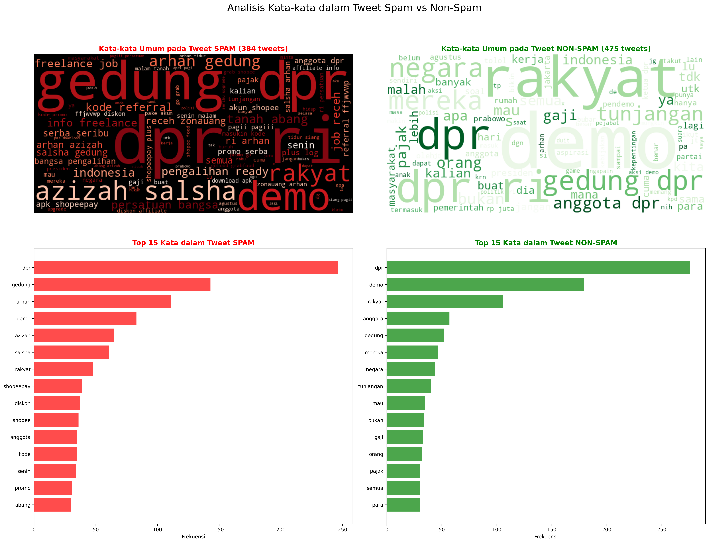
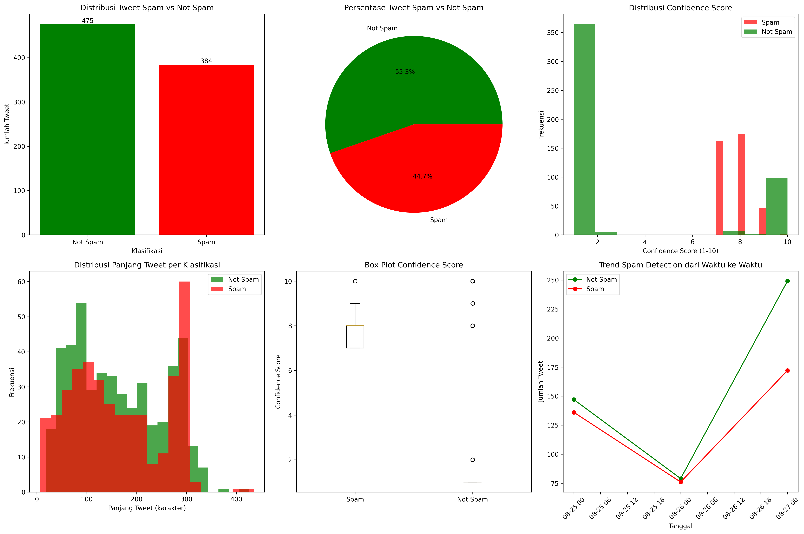

# 🚀 Capstone Project – Analisis Sentimen & Deteksi Spam Twitter

Proyek ini merupakan **Capstone Project** dari **Frenky Riski Gilang Pratama** yang berfokus pada **Data Classification & Summarization** menggunakan **IBM Granite LLM**.  
Dataset yang digunakan berasal dari hasil **crawling Twitter** pada periode **1 Agustus 2025 – 26 Agustus 2025**.  

---

## 📌 Deskripsi Proyek
Tujuan utama dari proyek ini adalah mengeksplorasi bagaimana **Large Language Model (LLM)** dapat digunakan untuk:
- 🔎 **Deteksi spam** dalam percakapan di Twitter.  
- 😀 **Klasifikasi teks** untuk memahami pola konten.  
- 📝 **Ringkasan otomatis** dari kumpulan data sosial media.  
- 📊 **Visualisasi** pola bahasa & distribusi spam.  

---

## 📂 Struktur Repository
```
Spam-Detection/
├── Code/
│   └── Analisis_Sentimen.ipynb
│   └── crawling_data_X.ipynb
├── Dataset/
│   └── demoDPR.csv
│   └── demoDPR_Gabungan.csv
│   └── demoDPRup.csv
│   └── demoDPRip1.csv
├── Output/
│   └── deteksi_spam_detail_20250828_070506.csv
│   └── spam_detection_report_20250828_070511.md
│   └── spam_word_analysis_20250828_070516.json
│   └── tweet_spam_summary_20250828_070506.csv
│   └── visualisasi_spam_detail_20250828_070506.png
│   └── wordcloud_spam_analysis_20250828_070512.png
└── README.md
```
---

## ⚙️ Teknologi yang Digunakan
- **Python** (Pandas, Numpy, Matplotlib, Seaborn)  
- **LangChain Community + Replicate API** (akses IBM Granite LLM)    
- **WordCloud** untuk visualisasi teks  

---

## 🔍 Insight & Temuan Utama
- Proporsi **spam** dalam dataset relatif kecil dibandingkan non-spam.  
- Pola spam paling umum:  
  - 🔗 Link mencurigakan (bit.ly, tinyurl, dll.)  
  - 📢 Promosi berlebihan (*GRATIS, KLIK SEKARANG!*)  
  - ❗ Penggunaan tanda baca/emoji berlebihan.  
- Wordcloud spam menampilkan kata dominan terkait **promosi & link**,  sedangkan non-spam lebih banyak berisi **opini & komentar alami**.  

---

<p align="center">
  
  
</p>

---

## 🤖 Peran AI (IBM Granite)
- Melakukan klasifikasi teks menjadi **Spam vs Non-Spam**.  
- Memberikan **penjelasan otomatis** untuk setiap hasil klasifikasi.  
- Membantu menghasilkan **ringkasan eksekutif** dari data Twitter.  

---

## ✅ Kesimpulan & Rekomendasi
- Proporsi spam relatif rendah.
- Spam didominasi oleh link pendek + promosi clickbait.
- AI efektif dalam klasifikasi dan memberikan penjelasan mengapa..  

---

## 💡Rekomendasi:  
- Tambahkan analisis **sentimen (positif/negatif/netral)**.
- Analisis tren spam berdasarkan **linimasa** (tanggal/waktu).  
